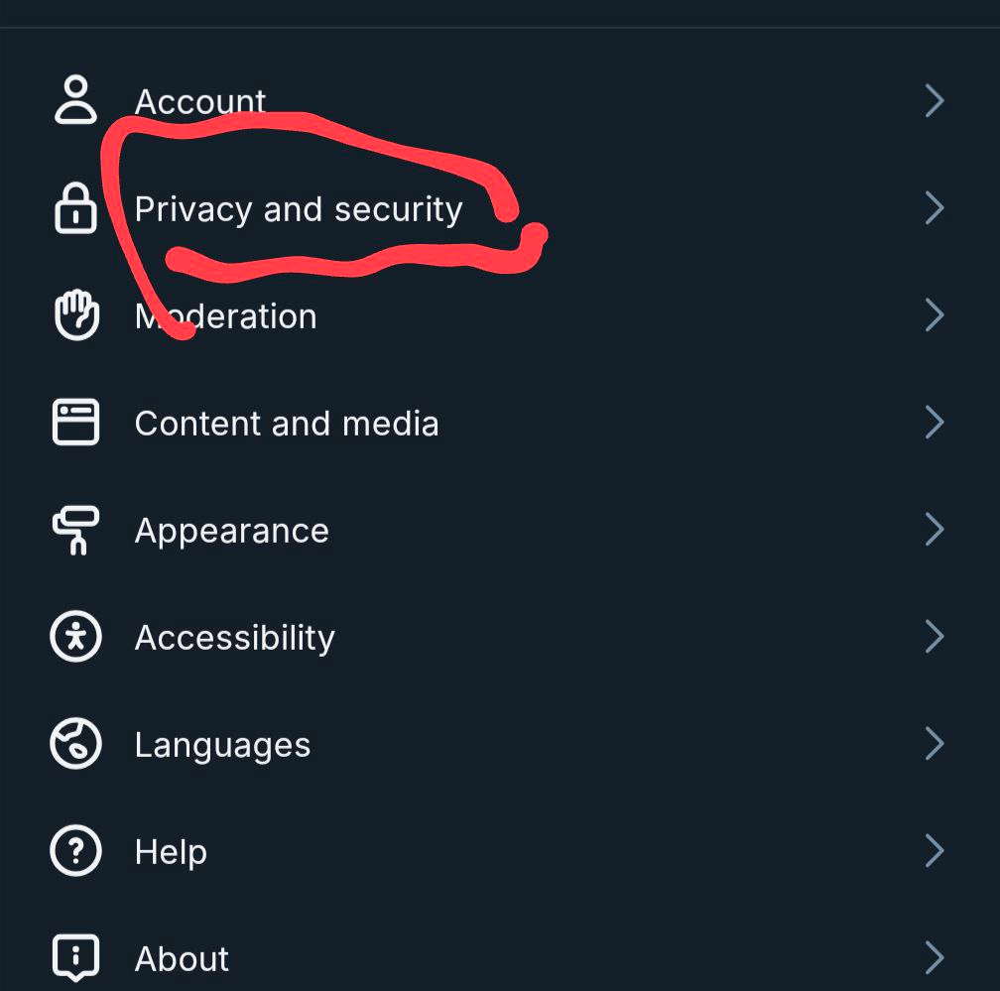
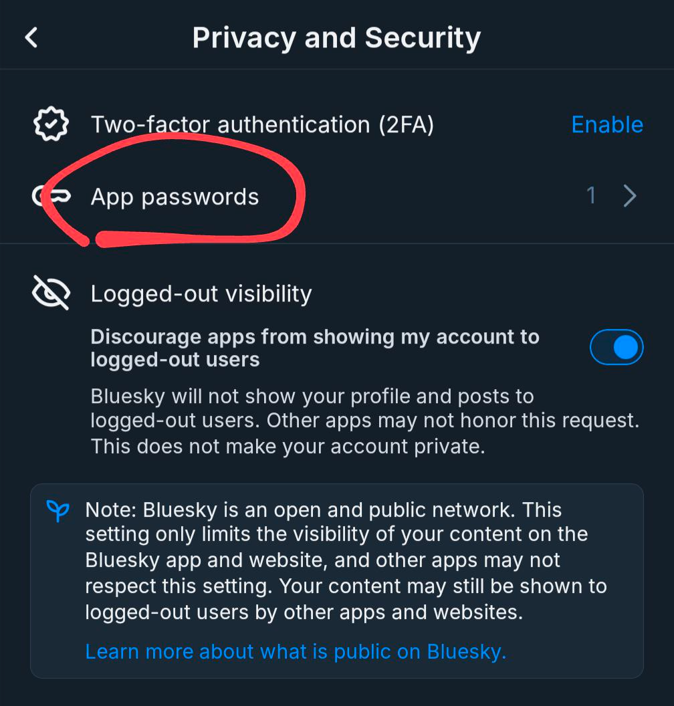
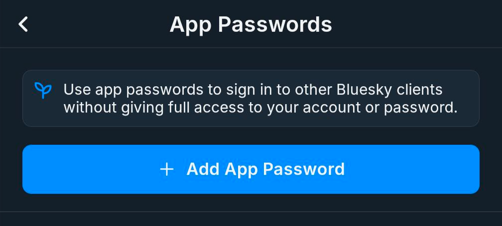

# BlueSky Auto-Follow Back Script

This Python script automatically follows back new followers on BlueSky that you are not already following.

## Features

- Logs into your BlueSky account
- Confirms successful connection
- Fetches the list of your followers and following
- Identifies new followers you are not following back
- Automatically follows back new followers

## Requirements

- Python 3.7 or higher
- `virtualenv` package for creating a virtual environment
- BlueSky account credentials

## Setup Instructions

### 1. Clone the Repository

Clone this repository to your local machine:

```bash
git clone https://github.com/yourusername/bluesky-autofollow.git
cd bluesky-autofollow

```

### 2. Create a Virtual Environment (Optional but Recommended)

It's recommended to create a virtual environment to isolate the project dependencies. You can create a virtual environment using the `virtualenv` package:

```bash
python3 -m venv env
source env/bin/activate  # On Windows, use `env\Scripts\activate`
```

### 3. Install Dependencies

Install the required Python packages:

```bash
pip install -r requirements.txt
```

### 4. Set up Environment Variables

Create a `.env` file in the project root directory and add your BlueSky username and password:

```.env
BLUESKY_USERNAME=your_bluesky_username
BLUESKY_PASSWORD=your_bluesky_password
```

## Obtain a password from the BlueSky app, go into settings, Privacy and secturity.



## Click on App passwords



## Click on Add App Password




Replace `your_bluesky_username` and `your_bluesky_password` with your actual BlueSky credentials.

### 5. Run the Script

After completing the setup, you can run the script:

```bash
python3 bluesky_autofollow.py
```

```
Logging in to BlueSky...
Successfully logged in to BlueSky.
Fetching followers...
Fetching following...
Found 47 new followers to follow back.
All new followers have been followed back. 🎉 Followed back 47 users! 👏
```
The script will log in to your BlueSky account, fetch the list of your followers and following, identify new followers you are not following back, and automatically follow them back.

### 6. Deactivate the Virtual Environment (Optional)

If you created a virtual environment, you can deactivate it when you're done:

```bash
deactivate
```

That's it! With these instructions, users should be able to set up the project, install the required dependencies, and run the script successfully.

## License

This project is licensed under the [MIT License](LICENSE).
